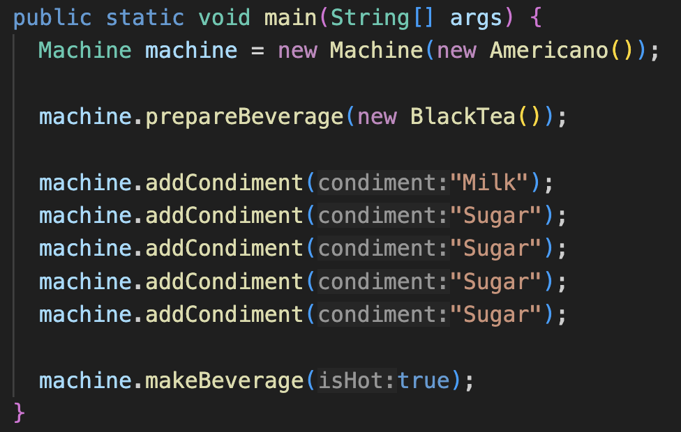

| CS-665       | Software Design & Patterns |
|--------------|----------------------------|
| Name         | Wei Wang       |
| Date         | 10/28/2024                 |
| Course       | Fall     |
| Assignment # |     6                       |

# Assignment Overview
Please add a paragraph or two overviewing the objectives of the assignment.

> This assignment is dedicated to improve the assignment 1, the coffee machine, because I identify several defects 
in design choices and is worthy to refactor to make the codebase more flexible and robust.

# GitHub Repository Link:
https://github.com/oliwave/cs-665-assignment-6

# Implementation Description 

For each assignment, please answer the following:

## Examine your code and identify opportunities for code improvement

1. Underlying implementations are exposed to clients, and clients required to take a series of actions in order to make a beverage
  - 
2. If we treat the `Machine` as the contract, API or interface whatever, it should be created as the Singleton pattern
3. Based on the `Beverage` specific types like `Coffee` and `Tea`, we should make it as resilient as possible to choose which beverage and implementation details the `Machine` should make according to the client's requests

## Describe the changes made to the code

- For the `1.`, I decided to create the `MachineFacade` class as the standard interface for clients to interact. That is, clients only need to know `makeCoffee` or `makeTea` without understanding the underlying details and managing the sequence of triggering different methods.
  - ```java
    MachineFacade machine = new MachineFacade();

    machine.makeCoffee(
      new LatteMacchiato(),
      false,
      new String[] { 
        "Milk", "Sugar", "Sugar", "Sugar", "Sugar" 
      });
    ```
- For the `2.`, thanks to the help of `MachineFacade`, the `Machine` as the specific implementation is fully decoupled with the Facade, which is just the API.
  - From the clients perspective, the underlying code can create as many `Machine` as you wish but clients can only interact with them through the Facade.
  - This significantly improves the simplicity by removing the interleaving interaction among internal objects and methods from the client code.
- For the `3.`, I remove the specific implementation in the `Tea` and `Coffee` classes by abstracting the logic to the `MakeTea` and `MakeCoffee`
  - In the `Beverage` class, we can determine the specific type of `Beverage` leveraging the polymorphism to swap the `makeBeverage` details at runtime
    - ```java
      public void changeMakeBeverage(MakeBeverage makeBeverage) {
        this.makeBeverage = makeBeverage;
      }
      ```
  - This is the implementation of ***Strategy Pattern***


# Maven Commands

We'll use Apache Maven to compile and run this project. You'll need to install Apache Maven (https://maven.apache.org/) on your system. 

Apache Maven is a build automation tool and a project management tool for Java-based projects. Maven provides a standardized way to build, package, and deploy Java applications.

Maven uses a Project Object Model (POM) file to manage the build process and its dependencies. The POM file contains information about the project, such as its dependencies, the build configuration, and the plugins used for building and packaging the project.

Maven provides a centralized repository for storing and accessing dependencies, which makes it easier to manage the dependencies of a project. It also provides a standardized way to build and deploy projects, which helps to ensure that builds are consistent and repeatable.

Maven also integrates with other development tools, such as IDEs and continuous integration systems, making it easier to use as part of a development workflow.

Maven provides a large number of plugins for various tasks, such as compiling code, running tests, generating reports, and creating JAR files. This makes it a versatile tool that can be used for many different types of Java projects.

## Compile
Type on the command line: 

```bash
mvn clean compile
```


## JUnit Tests
JUnit is a popular testing framework for Java. JUnit tests are automated tests that are written to verify that the behavior of a piece of code is as expected.

In JUnit, tests are written as methods within a test class. Each test method tests a specific aspect of the code and is annotated with the @Test annotation. JUnit provides a range of assertions that can be used to verify the behavior of the code being tested.

JUnit tests are executed automatically and the results of the tests are reported. This allows developers to quickly and easily check if their code is working as expected, and make any necessary changes to fix any issues that are found.

The use of JUnit tests is an important part of Test-Driven Development (TDD), where tests are written before the code they are testing is written. This helps to ensure that the code is written in a way that is easily testable and that all required functionality is covered by tests.

JUnit tests can be run as part of a continuous integration pipeline, where tests are automatically run every time changes are made to the code. This helps to catch any issues as soon as they are introduced, reducing the need for manual testing and making it easier to ensure that the code is always in a releasable state.

To run, use the following command:
```bash
mvn clean test
```


## Spotbugs 

SpotBugs is a static code analysis tool for Java that detects potential bugs in your code. It is an open-source tool that can be used as a standalone application or integrated into development tools such as Eclipse, IntelliJ, and Gradle.

SpotBugs performs an analysis of the bytecode generated from your Java source code and reports on any potential problems or issues that it finds. This includes things like null pointer exceptions, resource leaks, misused collections, and other common bugs.

The tool uses data flow analysis to examine the behavior of the code and detect issues that might not be immediately obvious from just reading the source code. SpotBugs is able to identify a wide range of issues and can be customized to meet the needs of your specific project.

Using SpotBugs can help to improve the quality and reliability of your code by catching potential bugs early in the development process. This can save time and effort in the long run by reducing the need for debugging and fixing issues later in the development cycle. SpotBugs can also help to ensure that your code is secure by identifying potential security vulnerabilities.

Use the following command:

```bash
mvn spotbugs:gui 
```

For more info see 
https://spotbugs.readthedocs.io/en/latest/maven.html

SpotBugs https://spotbugs.github.io/ is the spiritual successor of FindBugs.


## Checkstyle 

Checkstyle is a development tool for checking Java source code against a set of coding standards. It is an open-source tool that can be integrated into various integrated development environments (IDEs), such as Eclipse and IntelliJ, as well as build tools like Maven and Gradle.

Checkstyle performs static code analysis, which means it examines the source code without executing it, and reports on any issues or violations of the coding standards defined in its configuration. This includes issues like code style, code indentation, naming conventions, code structure, and many others.

By using Checkstyle, developers can ensure that their code adheres to a consistent style and follows best practices, making it easier for other developers to read and maintain. It can also help to identify potential issues before the code is actually run, reducing the risk of runtime errors or unexpected behavior.

Checkstyle is highly configurable and can be customized to fit the needs of your team or organization. It supports a wide range of coding standards and can be integrated with other tools, such as code coverage and automated testing tools, to create a comprehensive and automated software development process.

The following command will generate a report in HTML format that you can open in a web browser. 

```bash
mvn checkstyle:checkstyle
```

The HTML page will be found at the following location:
`target/site/checkstyle.html`


